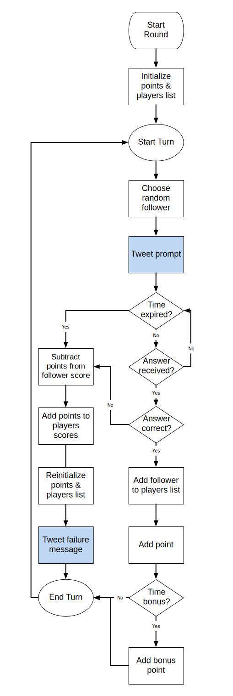

# bopitbot   

`bopitbot` is a simplistic, cooperative turn-based Twitter game written in Python. It is part social experiment and part goofy twitter fun. Read the instructions below to find out how to play along.

<!-- MarkdownTOC depth=3 -->

- [Instructions](#instructions)
- [Gameplay](#gameplay)
    - [Official Bots](#official-bots)
- [Planned Features](#planned-features)
- [Miscellaneous Notes](#miscellaneous-notes)
    - [Gameplay Flowchart](#gameplay-flowchart)
    - [Attributes](#attributes)

<!-- /MarkdownTOC -->

## Instructions

1. Follow [`@bopitbot`](http://twitter.com/bopitbot) on twitter.
2. Whenever `@bopitbot` issues you a command, respond to the appropriate [bot](#official-bots) within the allotted time to keep the game going.
3. Accumulate points and compete for spots on the leaderboard.

## Gameplay

Gameplay is divided into rounds consisting of one or more turns.

At the start of each turn, one of `@bopitbot`’s followers is randomly prompted to respond to one of six commands.

If the randomly chosen follower sucessfully responds to the correct `bopitbot` account within the alloted time, play continues on to the next randomly chosen follower’s turn.

However, if the chosen follower fails to respond to the appropriate `bopitbot` within the allotted time (or responds to an incorrect `bopitbot`), the round is over. The number of successful consecutive answers is tallied and points are awarded to all players who successfully responded during that round. Points are subtracted from the score of the chosen follower and the next round begins.

**Tip:** Players can maximize points by working together to chain multiple successful turns in order to earn bonus multipliers.

### Official Bots
- [`@bopitbot`](http://twitter.com/bopitbot)
- [`@twistitbot`](http://twitter.com/twistitbot)
- [`@pullitbot`](http://twitter.com/pullitbot)
- [`@spinitbot`](http://twitter.com/spinitbot)
- [`@flickitbot`](http://twitter.com/flickitbot)

## Planned Features
- Leaderboard
- Multiple bot accounts

## Miscellaneous Notes

### Gameplay Flowchart

### Attributes 

#### Player
- player name
- score
- successes
- fails
- created date

#### Round
- points
- chosen follower
- players list
